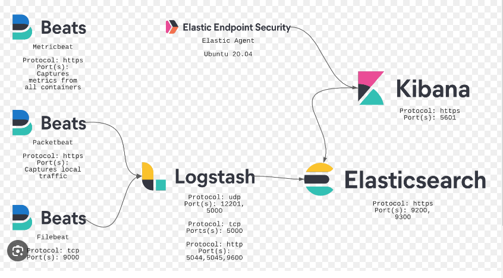

# udd

pdfbox - Apache PDFBox is an open-source Java library for working with PDF documents.

lombok - 
@Getter: Generates getter methods for your fields.
@Setter: Generates setter methods for your fields.

@NoArgsConstructor: Generates a constructor with no parameters.
@AllArgsConstructor: Generates a constructor with parameters for all fields.
@RequiredArgsConstructor: Generates a constructor with parameters for the fields marked with @NonNull.

jakarta.persistence-api - Annotations: JPA provides a set of annotations that allow developers to map Java objects to database tables. Annotations like @Entity, @Table, @Column, @Id, @GeneratedValue, etc., are commonly used for mapping Java classes and their properties to corresponding database entities and columns.

MinIO Object Storage for Container